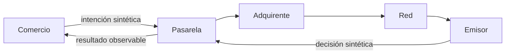

# 01. Modelo de una pasarela y sus actores

## Concepto

Una pasarela de pago es una frontera de integración. Recibe una intención de
cobro del comercio y coordina mensajes entre sistemas que cumplen papeles
distintos. En este curso los papeles se modelan como nombres y estados
sintéticos; no representan participantes reales ni transmiten datos de pago.

## Problema

Reducir un pago a una respuesta de éxito o error borra información que será
necesaria para reintentos, conciliación y soporte: quién fue responsable de
una decisión, si el estado es definitivo y qué evidencia se conserva. Cuando
esa frontera es implícita, los errores terminan convertidos en supuestos.

## Alternativas

| Alternativa | Ventaja | Costo o límite |
| --- | --- | --- |
| Llamada directa a un proveedor | Arranque rápido | Acopla el dominio a un contrato externo. |
| Orquestador propio grande | Control aparente | Amplía el alcance hacia un procesador que este curso no construye. |
| Contrato interno pequeño | Fronteras y estados visibles | Requiere nombrar decisiones y errores. |

## Justificación

El curso adopta un contrato interno pequeño. Diferencia al comercio, la
pasarela y las contrapartes sin pretender simular una red financiera. El
resultado es suficiente para estudiar estados, idempotencia y auditoría en
capítulos posteriores, sin introducir credenciales, red o dinero real.

## Fronteras que permanecen fuera

- Autorización de tarjetas, transferencia de datos y reglas de red.
- Datos personales, cuentas, identificadores reales y secretos.
- Cumplimiento, certificación o asesoría de PCI-DSS, 3-D Secure o SCA.
- Disponibilidad, latencia y contratos de un proveedor concreto.

## Implementación del capítulo

El módulo `gateway` representa una intención sintética, los actores y un
resultado observable. Sus pruebas verifican que las fronteras sean explícitas
y que el ejemplo no pueda confundirse con una operación real.

## Criterio de calidad y medición

**Benchmark:** no aplica. La evaluación de este capítulo es una asignación en
memoria y no representa la latencia, disponibilidad ni capacidad de una
pasarela. Medirla produciría números sin valor pedagógico y podría sugerir una
comparación con proveedores reales que el curso no hace.

**Property testing:** no se agrega una dependencia. Las invariantes actuales
son finitas y se cubren mejor con pruebas deterministas y legibles: una
referencia vacía se rechaza y una intención recibida conserva su referencia al
pasar al estado aceptado. Cuando un capítulo introduzca espacios de entrada
amplios o combinatorios, volverá a justificar si necesita pruebas generativas.
