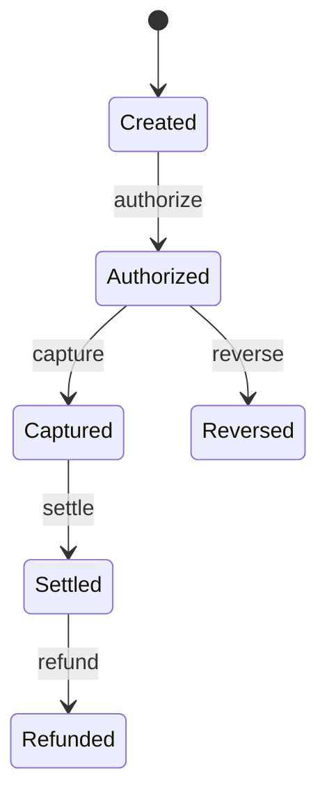

# 03. Ciclo de vida de una transacción

## Concepto

Un pago cambia de significado mientras avanza. Autorización, captura,
liquidación, reverso y reembolso son transiciones separadas con precondiciones
distintas. En este curso cada transición es sintética y ocurre en memoria.

## Problema

Un estado implícito permite acciones incompatibles: capturar dos veces,
reembolsar antes de liquidar o revertir una captura. El error se vuelve difícil
de auditar porque la intención de cada operación ya no está en el modelo.

## Alternativas y justificación

Un booleano `paid` es breve pero insuficiente. Una colección libre de eventos
es flexible pero exige reconstruir reglas en cada consumidor. Se elige una
máquina de estados explícita: rechaza transiciones inválidas cerca de su causa
y conserva la evidencia necesaria para los siguientes capítulos.

## Calidad

No aplica benchmark: el valor es semántico, no de rendimiento. No se agrega
property testing mientras todas las transiciones posibles estén cubiertas por
una tabla determinista y legible.

Las pruebas cubren la captura antes de autorización y el reembolso después de
liquidación. Esas dos fronteras demuestran el objetivo del modelo sin añadir
una dependencia ni prometer cobertura sobre un proveedor real.
